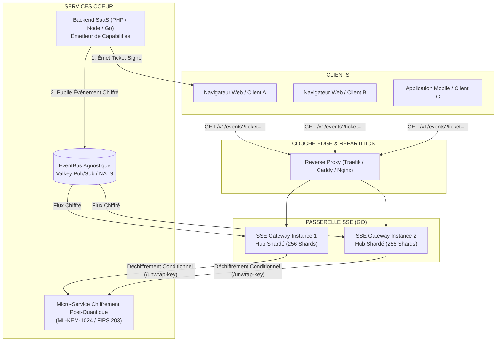

# Passerelle Server-Sent Events (SSE) en Go

[🇬🇧 English](README.md) | [🇫🇷 Français](README.fr.md)

[](https://github.com/fdecourt/sse_gateway/releases)
[](https://hub.docker.com/r/fdecourt/sse_gateway)
[](https://go.dev/)
[](LICENSE)

Ce projet implémente une **passerelle Server-Sent Events (SSE)** en Go. Elle gère les connexions HTTP persistantes des clients et diffuse les flux d'événements reçus depuis un bus de messages (tel que Valkey ou Redis Pub/Sub).

Image Docker Hub : `fdecourt/sse_gateway:0.0.1` / `fdecourt/sse_gateway:latest`

```bash
docker pull fdecourt/sse_gateway:0.0.1
```

> [!IMPORTANT]
> **Périmètre Architectural & Modèle de Confiance** :
> Ce composant est **stateless** (en dehors des connexions actives en mémoire). Il ne stocke aucune clé privée cryptographique, n'accède à aucune base de données et ne contient aucune règle métier applicative. L'autorisation des clients est vérifiée à la volée via des **jetons de capability** signés (JWT EdDSA), et le déballage des clés de chiffrement est délégué à un microservice dédié si nécessaire.

---

## 1. Modèle d'Architecture Globale



---

## 2. Principes d'Architecture

1. **Hub Shardé (256 partitions)** : Répartition des abonnés sur 256 segments protégés par des verrous `sync.RWMutex` distincts afin de limiter la contention.
2. **Déchiffrement Conditionnel** : Si une instance locale ne possède aucun abonné pour un topic donné, le message entrant est ignoré sans opération cryptographique ni allocation mémoire.
3. **Diffusion par Pointeur Unique** : Lorsqu'un événement concerne plusieurs abonnés locaux, la trame SSE (`*hub.Frame`) est préparée une seule fois en mémoire et partagée par référence aux abonnés concernés.
4. **Configuration par Variables d'Environnement** : Tous les paramètres (ports, adresses, tailles de tampons, timeouts, limites de requêtes) sont configurables via l'environnement ou les secrets Docker `_FILE`.
5. **Gestion du Backpressure** : Plusieurs politiques configurables (`disconnect`, `drop_oldest`, `drop_newest`) permettent d'isoler les clients dont la vitesse de lecture est insuffisante.
6. **Conteneur Minimal** : Binaire statique exécuté dans une image `FROM scratch` sans dépendances externes ni shell, avec un drapeau d'auto-contrôle `-healthcheck`.

---

## 3. Benchmarks

Mesures obtenues sur processeur Intel Core Ultra 9 sous Go 1.27 (médiane sur `-count=3`) :

```text
BenchmarkHubLookup-24          45 699 835 ops     28.2 ns/op       0 B/op     0 allocs/op
BenchmarkHubRegister-24        14 942 713 ops     79.3 ns/op       3 B/op     1 allocs/op
BenchmarkFanout10-24            4 045 094 ops    297.6 ns/op      80 B/op     1 allocs/op
BenchmarkFanout100-24             479 569 ops   2571.0 ns/op     896 B/op     1 allocs/op
BenchmarkFanout1000-24             40 465 ops  30778.0 ns/op    8192 B/op     1 allocs/op
BenchmarkFrameShared-24         4 962 267 ops    274.2 ns/op     216 B/op     3 allocs/op
BenchmarkEventRouting-24        1 905 792 ops    639.5 ns/op     288 B/op     5 allocs/op
```

L'enregistrement d'un abonné est passé de 203 ns/op et 2 allocations à 79 ns/op et 1 lorsque la
comptabilité des quotas est passée sous un verrou unique, ce qui a par ailleurs supprimé une
fenêtre TOCTOU sur les limites de connexions.

---

## 4. Démarrage Rapide

### 4.1 En Local (Développement)
```powershell
$env:SSE_ENVIRONMENT="development"
$env:SSE_EVENT_BUS_DRIVER="memory"
$env:SSE_CRYPTO_DRIVER="mock"
$env:SSE_AUTH_DRIVER="mock"

go run ./cmd/server
```

> `SSE_ENVIRONMENT` vaut `production` par défaut, où les pilotes `mock` d'authentification et de
> chiffrement sont refusés — ils sont d'ailleurs exclus du binaire compilé avec `-tags production`.
> Il faut donc positionner explicitement `development` pour les utiliser.
>
> Lancer le paquet (`./cmd/server`) et non un fichier isolé : le câblage des mocks vit dans des
> fichiers à balises de compilation, aux côtés de `main.go`.

### 4.2 Pile de développement (Docker Compose)
```powershell
make docker-dev
```

La commande amorce les identifiants de développement dans `.dev/` (jamais versionné), puis
démarre la passerelle, un bus d'événements Valkey et un **véritable** microservice
cryptographique post-quantique, en attendant que toutes les sondes de santé passent au vert.
Les ports sont liés à la boucle locale et décalés — passerelle sur `18080`, service
cryptographique sur `18085`, Valkey sur `16379` — afin qu'un `make run` local puisse conserver
le port `8080`.

La passerelle valide des tickets de capacité EdDSA : il lui faut donc la clé publique
correspondante. `make dev-keys` l'écrit dans `.dev/gateway.env`, que le fichier compose
consomme. La même commande pré-signe un lot de tickets pour k6, qui ne sait pas signer en
EdDSA. Elle est idempotente : la graine est conservée, donc les tickets déjà émis restent
valides.

### 4.3 Tests et Benchmarks
```powershell
make test        # tests unitaires et d'intégration, hermétiques
make bench       # benchmarks du Hub et du fan-out
make test-e2e    # chaîne cryptographique complète contre la pile vivante
```

`make test-e2e` démarre la pile et exécute la suite `tests/e2e`, qui parcourt le chemin réel de
bout en bout : clé de données scellée par ML-KEM-1024, charge utile chiffrée en AES-256-GCM
sous AAD liée au routage, diffusion SSE, et rejet de toute enveloppe altérée. Ces tests sont
isolés derrière l'étiquette de compilation `e2e`, de sorte que `go test ./...` reste hermétique
et n'exige aucun Docker.

### 4.4 Tests de charge
```powershell
make load-test     # k6 : montée en flux SSE persistants
make load-events   # dans un second terminal : injection de trafic réellement chiffré
```

k6 porte la charge côté client — plusieurs centaines de flux persistants — pendant que
`eventgen` publie de véritables événements chiffrés, k6 ne sachant ni encapsuler en ML-KEM ni
publier sur le bus. Les deux se rejoignent dans les compteurs Prometheus de la passerelle.

---

## 5. Endpoints de l'API

| Méthode | Route | Description |
| :--- | :--- | :--- |
| `GET` | `/v1/events?ticket=...` | Flux Server-Sent Events persistant (requiert un jeton signé) |
| `GET` | `/healthz` | Sonde de vitalité du processus (Liveness probe) |
| `GET` | `/readyz` | Sonde de disponibilité des dépendances (Readiness probe) |
| `GET` | `/metrics` | Métriques Prometheus |

---

## 6. Schéma d'Événement et Déballage de Clé

Les événements sont consommés depuis le bus au format `realtime-event-v1`. Toute version de schéma
inconnue est rejetée avant le moindre travail cryptographique ; un champ `schema` absent reste accepté
par rétrocompatibilité.

```json
{
  "schema": "realtime-event-v1",
  "event_id": "evt-4242",
  "tenant_id": "tenant-acme",
  "app_id": "app-store",
  "topic_id": "orders",
  "type": "order.created",
  "version": 7,
  "crypto": {
    "algorithm": "ML-KEM-1024",
    "version": "GO-PQC-GATEWAY-V2",
    "suite_id": 3,
    "encapsulated_key": "<base64>",
    "wrapped_key": "<base64>",
    "nonce": "<base64, 12 octets>",
    "payload_nonce": "<base64, 12 octets>",
    "ciphertext": "<base64>"
  }
}
```

### Deux nonces, jamais interchangeables

| Champ | Protège | Consommé par |
| :--- | :--- | :--- |
| `crypto.nonce` | `wrapped_key` (l'enveloppe de la DEK) | Le service de déballage de clé |
| `crypto.payload_nonce` | `ciphertext` (la charge utile applicative) | Cette passerelle, localement, une fois la DEK obtenue |

Ce sont deux opérations AES-GCM sous deux clés différentes. `payload_nonce` est **obligatoire** : un
événement qui en est dépourvu est rejeté en amont, avant l'appel KEM coûteux. Réutiliser le nonce
d'enveloppe comme nonce de payload est une erreur de protocole, et elle échoue franchement.

> `suite_id` est un **entier non signé 16 bits** sur le fil, jamais une chaîne entre guillemets.
> Il en va de même dans la requête `/unwrap-key` transmise au service cryptographique.

### Flux côté producteur

1. `POST /generate-key` sur le service cryptographique → retourne la DEK ainsi que `encapsulated_key`,
   `wrapped_key`, `nonce`, `algorithm`, `version`, `suite_id`.
2. Chiffrer la charge utile en AES-256-GCM sous cette DEK, avec un `payload_nonce` **généré à neuf** et
   l'AAD dérivée de `SSE_CRYPTO_AAD_TEMPLATE`
   (par défaut `{tenant_id}|{app_id}|{topic_id}|{event_id}|{version}`).
3. Effacer la DEK de la mémoire, puis publier l'événement ci-dessus sur le bus.

Attention : `version` apparaît deux fois avec des sens distincts — la version de l'entité à la racine
(entier) et la version de l'enveloppe cryptographique dans le bloc `crypto` (chaîne).

### Transport vers le service cryptographique

Interopérable avec [go-pqc-gateway](https://github.com/fdecourt/go-pqc-gateway).

| Réglage | Valeur | Effet |
| :--- | :--- | :--- |
| `SSE_CRYPTO_HTTP_BASE_URL` | `unix:///tmp/pq-crypto/pq.sock` | Socket de domaine Unix — la DEK ne quitte jamais la machine hôte |
| `SSE_CRYPTO_HTTP_BASE_URL` | `http://hote:8080` | Réseau TCP privé |
| `SSE_CRYPTO_HTTP_BINARY_MODE` | `true` (défaut) | Trame binaire V2 en `application/octet-stream` : ~25 % d'octets en moins, et la DEK revient en octets bruts effaçables in situ plutôt que via une chaîne Go immuable |
| `SSE_CRYPTO_HTTP_BINARY_MODE` | `false` | Repli JSON + Base64 |

Le service cryptographique n'expose aucune authentification propre : le contrôle d'accès se fait au
niveau réseau ou socket. Privilégier le socket Unix dès que les deux services partagent un hôte — la
passerelle PQC ne parle pas TLS, un TCP en clair exposerait donc la DEK déballée sur le réseau.

---

## 7. Sécurité et Exploitation

- **Contrôle d'Accès** : Validation asynchrone des signatures EdDSA (Ed25519) contenant les topics autorisés et la durée de validité.
- **Protection des Ressources** : Limitation du débit (Rate Limiting par seau à jetons) par IP pour limiter les abus de connexion.
- **Arrêt Gracieux** : Interception de `SIGTERM` et `SIGINT` pour fermer proprement les flux actifs avant l'arrêt du service.
- **Observabilité** : Journalisation JSON structurée (`log/slog`) avec masquage automatique des identifiants d'URL, sondes de santé et métriques Prometheus.
