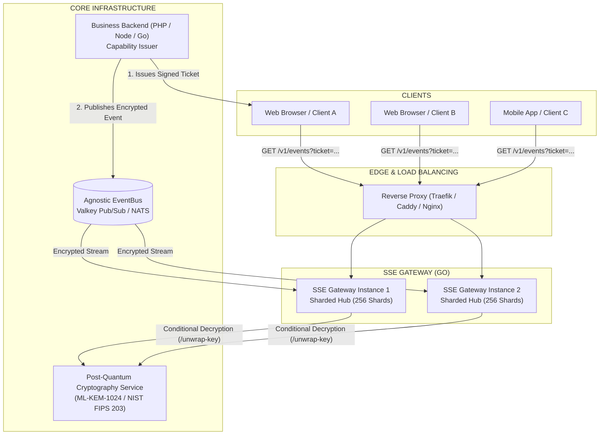

# Server-Sent Events (SSE) Gateway in Go

[🇬🇧 English](README.md) | [🇫🇷 Français](README.fr.md)

[](https://github.com/fdecourt/sse_gateway/releases)
[](https://hub.docker.com/r/fdecourt/sse_gateway)
[](https://go.dev/)
[](LICENSE)

This repository provides a **Server-Sent Events (SSE) Gateway** written in Go. It manages persistent HTTP client connections and distributes event streams received from a message broker (such as Valkey or Redis Pub/Sub).

Docker Hub Image: `fdecourt/sse_gateway:0.0.1` / `fdecourt/sse_gateway:latest`

```bash
docker pull fdecourt/sse_gateway:0.0.1
```

> [!IMPORTANT]
> **Architectural Boundary & Trust Model**:
> This service is **stateless** (holding only active client connections in memory). It does not store private cryptographic keys, has no direct database access, and contains no application business logic. Client authorization is verified via signed **capability tokens** (EdDSA JWTs), and payload key unwrapping is delegated to an external decryption service when required.

---

## 1. High-Level Architecture



---

## 2. Architecture & Design Principles

1. **Sharded Hub (256 Shards)**: Divides connection state across 256 partitions, each protected by an independent `sync.RWMutex` to minimize lock contention.
2. **Conditional Decryption**: If an instance has no local subscribers for an incoming topic, the message is discarded without performing decryption calls or memory allocations.
3. **Single Serialization Fan-Out**: When an event targets multiple subscribers on the same node, the payload is decrypted once and converted to a shared frame pointer (`*hub.Frame`) broadcast to all matching subscriber channels.
4. **Environment-Driven Configuration**: Configuration parameters (ports, URLs, buffer sizes, timeouts, rate limits) are loaded from environment variables or Docker `_FILE` secrets.
5. **Backpressure Handling**: Configurable policies (`disconnect`, `drop_oldest`, `drop_newest`) handle slow clients unable to keep up with event velocity.
6. **Minimal Container**: The build produces a static binary deployed `FROM scratch` with non-root execution (`10001:10001`) and a built-in `-healthcheck` flag.

---

## 3. Benchmarks

Measured on Intel Core Ultra 9 with Go 1.27 (median of `-count=3`):

```text
BenchmarkHubLookup-24          45,699,835 ops     28.2 ns/op       0 B/op     0 allocs/op
BenchmarkHubRegister-24        14,942,713 ops     79.3 ns/op       3 B/op     1 allocs/op
BenchmarkFanout10-24            4,045,094 ops    297.6 ns/op      80 B/op     1 allocs/op
BenchmarkFanout100-24             479,569 ops   2571.0 ns/op     896 B/op     1 allocs/op
BenchmarkFanout1000-24             40,465 ops  30778.0 ns/op    8192 B/op     1 allocs/op
BenchmarkFrameShared-24         4,962,267 ops    274.2 ns/op     216 B/op     3 allocs/op
BenchmarkEventRouting-24        1,905,792 ops    639.5 ns/op     288 B/op     5 allocs/op
```

Subscriber registration went from 203 ns/op and 2 allocations to 79 ns/op and 1 when quota
accounting moved behind a single lock, which also removed a TOCTOU window on connection limits.

---

## 4. Quick Start

### 4.1 Standalone Mode (Local Development)
```powershell
$env:SSE_ENVIRONMENT="development"
$env:SSE_EVENT_BUS_DRIVER="memory"
$env:SSE_CRYPTO_DRIVER="mock"
$env:SSE_AUTH_DRIVER="mock"

go run ./cmd/server
```

> `SSE_ENVIRONMENT` defaults to `production`, where the `mock` auth and crypto drivers are
> rejected outright — they are also excluded from the binary when built with `-tags production`.
> Set `development` explicitly to use them.
>
> Run the package (`./cmd/server`), not a single file: the mock wiring lives in build-tagged
> files alongside `main.go`.

### 4.2 Development Stack (Docker Compose)
```powershell
make docker-dev
```

This bootstraps the development credentials into `.dev/` (never committed), then starts the
gateway, a Valkey event bus and a **real** post-quantum crypto service, waiting until every
health probe is green. Ports are bound to the loopback interface and shifted — gateway on
`18080`, crypto service on `18085`, Valkey on `16379` — so a local `make run` can keep `8080`.

The gateway validates EdDSA capability tokens, so it needs the matching public key: `make
dev-keys` writes it to `.dev/gateway.env`, which the compose file reads. That command also
pre-signs a pool of tickets for k6, which cannot sign EdDSA itself. It is idempotent — the
seed is reused, so previously issued tickets stay valid.

### 4.3 Tests and Benchmarks
```powershell
make test        # unit and integration tests, hermetic
make bench       # Hub and fan-out benchmarks
make test-e2e    # full cryptographic chain against the live stack
```

`make test-e2e` starts the stack and runs the suite in `tests/e2e`, which exercises the real
path end to end: a data key sealed by ML-KEM-1024, a payload encrypted with AES-256-GCM under
routing-bound AAD, delivery over SSE, and rejection of every tampered envelope. These tests sit
behind the `e2e` build tag, so `go test ./...` stays hermetic and needs no Docker.

### 4.4 Load Testing
```powershell
make load-test     # k6: ramp of persistent SSE streams
make load-events   # in a second terminal: inject genuinely encrypted traffic
```

k6 carries the client-side load — hundreds of persistent streams — while `eventgen` publishes
real encrypted events, since k6 can neither perform ML-KEM encapsulation nor publish to the
bus. The two meet in the gateway's Prometheus counters.

---

## 5. API Endpoints

| Method | Endpoint | Description |
| :--- | :--- | :--- |
| `GET` | `/v1/events?ticket=...` | Persistent SSE stream (requires signed ticket parameter) |
| `GET` | `/healthz` | Process liveness probe |
| `GET` | `/readyz` | Dependency readiness probe |
| `GET` | `/metrics` | Prometheus metrics |

---

## 6. Event Schema and Key Unwrapping

Events are consumed from the bus in the `realtime-event-v1` schema. Unknown schema versions are
rejected before any cryptographic work; an absent `schema` field is accepted for backward compatibility.

```json
{
  "schema": "realtime-event-v1",
  "event_id": "evt-4242",
  "tenant_id": "tenant-acme",
  "app_id": "app-store",
  "topic_id": "orders",
  "type": "order.created",
  "version": 7,
  "crypto": {
    "algorithm": "ML-KEM-1024",
    "version": "GO-PQC-GATEWAY-V2",
    "suite_id": 3,
    "encapsulated_key": "<base64>",
    "wrapped_key": "<base64>",
    "nonce": "<base64, 12 bytes>",
    "payload_nonce": "<base64, 12 bytes>",
    "ciphertext": "<base64>"
  }
}
```

### Two nonces, never interchangeable

| Field | Protects | Consumed by |
| :--- | :--- | :--- |
| `crypto.nonce` | `wrapped_key` (the DEK envelope) | The key unwrapping service |
| `crypto.payload_nonce` | `ciphertext` (the application payload) | This gateway, locally, once the DEK is available |

These are two AES-GCM operations under two different keys. `payload_nonce` is **mandatory**: an event
without it is rejected up front, before the costly KEM call. Reusing the envelope nonce as the payload
nonce is a protocol error and fails closed.

> `suite_id` is an **unsigned 16-bit integer** on the wire, never a quoted string. The same applies to
> the `/unwrap-key` request sent to the crypto service.

### Producer flow

1. `POST /generate-key` on the crypto service → returns the DEK plus `encapsulated_key`, `wrapped_key`,
   `nonce`, `algorithm`, `version`, `suite_id`.
2. Encrypt the payload with AES-256-GCM under that DEK, using a **freshly generated** `payload_nonce`
   and the AAD derived from `SSE_CRYPTO_AAD_TEMPLATE`
   (default `{tenant_id}|{app_id}|{topic_id}|{event_id}|{version}`).
3. Zeroize the DEK, then publish the event above onto the bus.

Note that `version` appears twice with different meanings: the entity version at the root (integer),
and the crypto envelope version inside the `crypto` block (string).

### Transport to the crypto service

Interoperable with [go-pqc-gateway](https://github.com/fdecourt/go-pqc-gateway).

| Setting | Value | Effect |
| :--- | :--- | :--- |
| `SSE_CRYPTO_HTTP_BASE_URL` | `unix:///tmp/pq-crypto/pq.sock` | Unix domain socket — the DEK never leaves the host |
| `SSE_CRYPTO_HTTP_BASE_URL` | `http://host:8080` | Private TCP network |
| `SSE_CRYPTO_HTTP_BINARY_MODE` | `true` (default) | `application/octet-stream` binary V2 framing: ~25% fewer bytes, and the DEK is returned as raw bytes that can be wiped in place rather than transiting through an immutable Go string |
| `SSE_CRYPTO_HTTP_BINARY_MODE` | `false` | JSON + Base64 fallback |

The crypto service exposes no authentication of its own: access control is enforced at the network
or socket layer. Prefer the Unix socket whenever both services share a host — the gateway does not
speak TLS, so plain TCP would expose the unwrapped DEK on the wire.

---

## 7. Security and Operations

- **Capability Verification**: Tickets are validated using asymmetric signatures (EdDSA Ed25519) containing authorized topics and expiration timestamps.
- **Resource Protection**: Token bucket rate limiters per IP address protect against connection floods.
- **Graceful Shutdown**: On `SIGTERM` or `SIGINT`, the server stops accepting new connections and cleanly drains active streams before exiting.
- **Observability**: Structured JSON logging (`log/slog`) with automatic query credential redaction, standard health endpoints, and Prometheus metrics.
